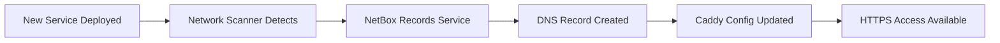

# Homelab Automation System - Operational User Guide

**Date:** September 5, 2025  
**For:** Daily Operations and Management  
**Audience:** System Administrators  
**Prerequisite:** Completed deployment following the deployment guide  

## Daily Operations Overview

This guide covers day-to-day operations of your homelab automation system. After deployment, the system largely runs itself, but you'll want to monitor it and occasionally add new services.

## Quick Reference Commands

```bash
# System health check
./scripts/orchestrate-homelab-automation.sh status

# Force discovery and sync
./scripts/orchestrate-homelab-automation.sh sync

# Add new service manually
./scripts/orchestrate-homelab-automation.sh add service-name ip-address port type

# View recent discovery data
ls -la /opt/netbox/discovery-scripts/exports/ | tail -5

# Check system logs
docker compose logs -f --tail=50 netbox
```

---

## Understanding Your Automation System

### **What Runs Automatically**

| Task | Frequency | What It Does |
|------|-----------|--------------|
| Network Discovery | Every 30 minutes | Scans network for new/changed services |
| DNS Synchronization | After discovery | Updates DNS records based on NetBox data |
| Caddy Configuration | After DNS sync | Updates reverse proxy for new services |
| Data Export | Every hour | Saves discovery data to JSON files |
| Ad List Updates | Daily at 3 AM | Refreshes ad blocking lists |
| SSL Certificate Renewal | Automatic | Renews certificates 30 days before expiry |

### **Data Flow Understanding**



---

## Daily Monitoring Tasks

### **Morning Health Check (2 minutes)**

```bash
# Quick system status
./scripts/orchestrate-homelab-automation.sh status

# Expected output - all should show ✅:
# 🌐 Core Services:
#    NetBox IPAM: ✅ Online
#    Technitium DNS: ✅ Online
#    GitLab: ✅ Online
```

**If any service shows ❌, see troubleshooting section.**

### **Weekly Review (10 minutes)**

**Check Discovery Reports:**
```bash
# View recent discovery activity
ls -la /opt/netbox/discovery-scripts/exports/ | tail -10

# Review latest discovery report
cat /opt/netbox/discovery-scripts/exports/discovery-report-$(date +%Y%m%d)*.json | jq '.total_hosts, .active_hosts, .dns_synced'
```

**Review NetBox Data:**
1. Open NetBox: `http://your-server:8080`
2. Go to IPAM → IP Addresses
3. Review newly discovered services
4. Verify descriptions and categorization
5. Update any incorrect service types

**Check DNS Health:**
```bash
# Verify DNS is working
dig @10.203.1.3 google.com

# Check ad blocking
dig @10.203.1.3 doubleclick.net  # Should return 0.0.0.0

# Test local services
dig @10.203.1.3 git.doofus.co
```

---

## Adding New Services

### **Method 1: Automatic Discovery (Recommended)**

Deploy your service normally and let the system discover it:

```bash
# Example: Deploy Grafana
docker run -d --name grafana \
  -p 3000:3000 \
  -e GF_SECURITY_ADMIN_PASSWORD=admin123 \
  grafana/grafana

# Wait up to 30 minutes for automatic discovery, or trigger manual sync:
./scripts/orchestrate-homelab-automation.sh sync

# Verify service was discovered:
dig @10.203.1.3 grafana.doofus.co
```

**Service will automatically get:**
- ✅ NetBox inventory entry
- ✅ DNS record (grafana.doofus.co)
- ✅ Caddy reverse proxy configuration
- ✅ SSL certificate
- ✅ HTTPS access

### **Method 2: Manual Addition**

For services that don't auto-discover correctly:

```bash
# Add service with specific configuration
./scripts/orchestrate-homelab-automation.sh add prometheus 10.203.3.55 9090 monitoring

# Parameters:
# - prometheus: hostname (will become prometheus.doofus.co)
# - 10.203.3.55: IP address of the service
# - 9090: port number
# - monitoring: service type (web, api, monitoring, secure, docs)
```

### **Method 3: NetBox Web Interface**

1. **Open NetBox:** `http://your-server:8080`
2. **Go to IPAM → IP Addresses → Add**
3. **Fill in details:**
   - Address: `10.203.3.100/32`
   - DNS Name: `service-name`
   - Status: `Active`
   - Description: `Service description`
4. **Save and run sync:**
   ```bash
   ./scripts/orchestrate-homelab-automation.sh sync
   ```

---

## Managing DNS Records

### **View Current DNS Records**

```bash
# List all records in your domain
curl -s "http://10.203.1.3:5380/api/zones/records/get?zone=doofus.co" \
     -H "Authorization: Bearer $TECHNITIUM_API_TOKEN" | jq '.response.records[]'
```

### **Manual DNS Record Management**

```bash
# Add A record
curl -X POST "http://10.203.1.3:5380/api/zones/records/add" \
     -H "Authorization: Bearer $TECHNITIUM_API_TOKEN" \
     -d "zone=doofus.co&domain=custom.doofus.co&type=A&ipAddress=10.203.3.200&ttl=300"

# Add CNAME record
curl -X POST "http://10.203.1.3:5380/api/zones/records/add" \
     -H "Authorization: Bearer $TECHNITIUM_API_TOKEN" \
     -d "zone=doofus.co&domain=alias.doofus.co&type=CNAME&cname=target.doofus.co&ttl=300"

# Delete record
curl -X POST "http://10.203.1.3:5380/api/zones/records/delete" \
     -H "Authorization: Bearer $TECHNITIUM_API_TOKEN" \
     -d "zone=doofus.co&domain=old-service.doofus.co&type=A"
```

### **Bulk DNS Updates**

For multiple DNS changes, edit NetBox and sync:

```bash
# Make changes in NetBox web interface, then:
./scripts/orchestrate-homelab-automation.sh sync
```

---

## SSL Certificate Management

### **Certificate Status Check**

```bash
# Check certificate expiry for your services
openssl s_client -connect git.doofus.co:443 -servername git.doofus.co 2>/dev/null | openssl x509 -noout -dates

# Check Caddy SSL status
curl -I https://git.doofus.co
```

### **Force Certificate Renewal**

```bash
# Restart Caddy to trigger renewal check
cd /opt/caddy && docker compose restart caddy

# Check Caddy logs for renewal activity
docker compose logs caddy | grep -i certificate
```

### **Add SSL for New Domain**

```bash
# If you need SSL for a new domain, add it to Caddyfile:
nano /opt/caddy/Caddyfile

# Add entry like:
# new-service.doofus.co {
#     tls {
#         dns cloudflare {env.CLOUDFLARE_API_TOKEN}
#     }
#     reverse_proxy 10.203.3.100:8080
# }

# Reload configuration
caddy reload --config /opt/caddy/Caddyfile
```

---

## Network Discovery Management

### **Understanding Discovery Data**

Discovery data is stored in two places:

1. **NetBox Database**: Persistent inventory
2. **JSON Exports**: Historical snapshots

### **Customizing Discovery Networks**

```bash
# Edit NetBox configuration to change discovery scope
nano /opt/netbox/.env

# Modify this line:
DISCOVERY_NETWORKS=10.203.0.0/16,100.64.0.0/10,192.168.1.0/24

# Restart discovery service
cd /opt/netbox && docker compose restart netbox-discovery
```

### **Manual Discovery Trigger**

```bash
# Force immediate network scan
./scripts/orchestrate-homelab-automation.sh sync

# Monitor discovery progress
docker logs -f netbox-discovery
```

### **Discovery Data Analysis**

```bash
# View discovery statistics
cd /opt/netbox/discovery-scripts/exports
ls -la *.json | tail -5

# Analyze latest report
jq '.total_hosts, .active_hosts, .services_discovered, .dns_synced' discovery-report-*.json | tail -4

# Find new hosts in last report
jq '.networks_scanned, .new_hosts' discovery-report-*.json | tail -2
```

---

## Service Management

### **Service Categories and Templates**

The system recognizes these service types:

| Type | Ports | Template Features |
|------|-------|-------------------|
| `web` | 80, 8080, 3000, 8000 | Standard reverse proxy |
| `api` | 8080, 9000, 3001 | CORS headers, API-friendly |
| `monitoring` | 3000, 9090, 9091 | Grafana/Prometheus optimized |
| `secure` | Any | Enhanced security headers |
| `docs` | 8000, 4000 | Documentation site optimization |

### **Custom Service Configuration**

For complex services requiring special configuration:

```bash
# Create custom Caddyfile snippet
nano /opt/caddy/services/special-service.conf

# Example custom configuration:
cat > /opt/caddy/services/special-service.conf << 'EOF'
special.doofus.co {
    tls {
        dns cloudflare {env.CLOUDFLARE_API_TOKEN}
    }
    reverse_proxy 10.203.3.100:8080 {
        header_up Host {upstream_hostport}
        header_up X-Custom-Header "special-value"
    }
    # Custom handling
    handle /api/* {
        reverse_proxy 10.203.3.101:9000
    }
    handle {
        reverse_proxy 10.203.3.100:8080
    }
}
EOF

# Include in main Caddyfile:
echo "import services/*.conf" >> /opt/caddy/Caddyfile

# Reload Caddy
caddy reload --config /opt/caddy/Caddyfile
```

---

## Monitoring and Alerting

### **Log Locations**

| Component | Log Location | Purpose |
|-----------|-------------|---------|
| NetBox | `docker compose logs netbox` | Web interface and API |
| Discovery | `/opt/netbox/discovery-scripts/logs/discovery.log` | Network scanning |
| DNS | Technitium web interface | DNS queries and blocks |
| Caddy | `docker compose logs caddy` | Reverse proxy and SSL |
| System | `/var/log/homelab-automation/` | Custom scripts |

### **Health Monitoring Scripts**

Create monitoring scripts for critical functions:

```bash
# Create monitoring directory
mkdir -p /opt/homelab-monitoring

# DNS health monitor
cat > /opt/homelab-monitoring/dns-monitor.sh << 'EOF'
#!/bin/bash
if ! dig @10.203.1.3 google.com +timeout=5 >/dev/null 2>&1; then
    echo "$(date): DNS server not responding" >> /var/log/dns-health.log
    # Add alert mechanism here (email, webhook, etc.)
fi
EOF

# Service discovery monitor
cat > /opt/homelab-monitoring/discovery-monitor.sh << 'EOF'
#!/bin/bash
LAST_EXPORT=$(ls -t /opt/netbox/discovery-scripts/exports/discovery-report-*.json | head -1)
if [[ -z "$LAST_EXPORT" ]] || [[ $(find "$LAST_EXPORT" -mmin +60) ]]; then
    echo "$(date): Discovery not running properly" >> /var/log/discovery-health.log
fi
EOF

# Make executable and schedule
chmod +x /opt/homelab-monitoring/*.sh

# Add to crontab
(crontab -l 2>/dev/null; echo "*/5 * * * * /opt/homelab-monitoring/dns-monitor.sh") | crontab -
(crontab -l 2>/dev/null; echo "*/15 * * * * /opt/homelab-monitoring/discovery-monitor.sh") | crontab -
```

### **Performance Monitoring**

```bash
# Check system resource usage
docker stats --no-stream

# Check disk usage for data directories
du -sh /opt/netbox/postgres-data /opt/netbox/netbox-media

# Monitor network connectivity
ping -c 4 8.8.8.8
```

---

## Backup Procedures

### **Daily Automated Backups**

```bash
# Create backup script
cat > /opt/homelab-monitoring/daily-backup.sh << 'EOF'
#!/bin/bash
DATE=$(date +%Y%m%d)
BACKUP_DIR="/opt/backups/$DATE"
mkdir -p "$BACKUP_DIR"

# NetBox database backup
docker exec netbox-postgres pg_dump -U netbox netbox > "$BACKUP_DIR/netbox-db.sql"

# Configuration backup
cp -r /opt/netbox/.env "$BACKUP_DIR/"
cp -r /opt/caddy/Caddyfile "$BACKUP_DIR/"

# DNS configuration backup
curl -H "Authorization: Bearer $TECHNITIUM_API_TOKEN" \
     "http://10.203.1.3:5380/api/settings/backup" \
     -o "$BACKUP_DIR/dns-config.zip"

# Discovery data backup
cp -r /opt/netbox/discovery-scripts/exports/*.json "$BACKUP_DIR/" 2>/dev/null

# Compress backup
tar -czf "/opt/backups/homelab-backup-$DATE.tar.gz" -C /opt/backups "$DATE"
rm -rf "$BACKUP_DIR"

# Keep only last 30 days
find /opt/backups -name "homelab-backup-*.tar.gz" -mtime +30 -delete

echo "$(date): Backup completed - /opt/backups/homelab-backup-$DATE.tar.gz"
EOF

# Make executable and schedule
chmod +x /opt/homelab-monitoring/daily-backup.sh

# Run at 2 AM daily
(crontab -l 2>/dev/null; echo "0 2 * * * /opt/homelab-monitoring/daily-backup.sh >> /var/log/backup.log 2>&1") | crontab -
```

### **Restore Procedures**

```bash
# List available backups
ls -la /opt/backups/homelab-backup-*.tar.gz

# Restore from backup
BACKUP_FILE="/opt/backups/homelab-backup-20250905.tar.gz"
RESTORE_DIR="/tmp/restore"

# Extract backup
mkdir -p "$RESTORE_DIR"
tar -xzf "$BACKUP_FILE" -C "$RESTORE_DIR"

# Stop services
cd /opt/netbox && docker compose down

# Restore database
docker compose up -d postgres
sleep 30
cat "$RESTORE_DIR"/*/netbox-db.sql | docker exec -i netbox-postgres psql -U netbox netbox

# Restore configurations
cp "$RESTORE_DIR"/*/.env /opt/netbox/.env
cp "$RESTORE_DIR"/*/Caddyfile /opt/caddy/Caddyfile

# Restart services
docker compose up -d

# Verify restore
./scripts/orchestrate-homelab-automation.sh status
```

---

## Integration with External Tools

### **Ansible Integration**

Use NetBox as dynamic inventory:

```bash
# Install NetBox dynamic inventory plugin
pip3 install ansible-netbox

# Create inventory configuration
cat > netbox_inventory.yml << 'EOF'
plugin: netbox.netbox.nb_inventory
api_endpoint: http://localhost:8080
token: your_netbox_api_token
validate_certs: false
config_context: false
interfaces: true
EOF

# Use with Ansible
ansible-inventory -i netbox_inventory.yml --list
```

### **Prometheus Monitoring**

```bash
# Add Prometheus configuration to scrape NetBox metrics
cat > /opt/monitoring/prometheus.yml << 'EOF'
global:
  scrape_interval: 15s

scrape_configs:
  - job_name: 'netbox'
    static_configs:
      - targets: ['localhost:8080']
    metrics_path: '/metrics'
    
  - job_name: 'technitium-dns'
    static_configs:
      - targets: ['10.203.1.3:5380']
    metrics_path: '/api/dashboard/stats/get'
    params:
      token: ['your_technitium_api_token']
EOF
```

### **Webhook Integrations**

Configure NetBox webhooks for external notifications:

1. **In NetBox Web Interface:**
   - Go to Extensibility → Webhooks → Add
   - Name: `Discord Notification`
   - Object types: `IP addresses`
   - URL: `https://discord.com/api/webhooks/your-webhook-url`
   - Events: `Creations`, `Updates`

2. **Test webhook:**
   - Add new IP address in NetBox
   - Verify notification received

---

## Common Operational Scenarios

### **Scenario 1: Adding Development Environment**

```bash
# Deploy development stack
docker run -d --name dev-api -p 3001:3000 your-dev-api
docker run -d --name dev-web -p 8081:80 your-dev-frontend

# Wait for discovery or trigger sync
./scripts/orchestrate-homelab-automation.sh sync

# Services automatically available at:
# https://dev-api.doofus.co
# https://dev-web.doofus.co
```

### **Scenario 2: Temporary Service Testing**

```bash
# Add temporary service
./scripts/orchestrate-homelab-automation.sh add test-app 10.203.3.199 8080 web

# Test functionality
curl -I https://test-app.doofus.co

# Remove when done
# 1. Stop the actual service
# 2. Remove from NetBox web interface
# 3. Run sync to clean up DNS and Caddy
./scripts/orchestrate-homelab-automation.sh sync
```

### **Scenario 3: Service Migration**

```bash
# Old service at 10.203.3.50, new at 10.203.3.75

# Update IP in NetBox web interface:
# 1. Find service in IPAM → IP Addresses
# 2. Edit IP address from 10.203.3.50 to 10.203.3.75
# 3. Save changes

# Sync configuration
./scripts/orchestrate-homelab-automation.sh sync

# DNS and reverse proxy automatically updated
```

---

## Performance Optimization

### **NetBox Performance**

```bash
# Monitor NetBox performance
docker stats netbox

# If slow, increase resources:
# Edit docker-compose.yml memory limits
# Restart with more resources:
cd /opt/netbox
docker compose down
docker compose up -d
```

### **DNS Performance**

```bash
# Check DNS query performance
dig @10.203.1.3 google.com | grep "Query time"

# Monitor DNS statistics in Technitium web interface
# Go to: Dashboard → Statistics
```

### **Discovery Performance**

```bash
# Adjust discovery frequency if needed
nano /opt/netbox/discovery-scripts/discovery-agent.py

# Find this line and modify interval:
# schedule.every(30).minutes.do(agent.run_discovery)
# Change to every(60).minutes for less frequent scans

# Restart discovery service
cd /opt/netbox && docker compose restart netbox-discovery
```

---

## Maintenance Calendar

### **Daily Tasks (Automated)**
- Network discovery scans
- DNS record synchronization
- SSL certificate monitoring
- Ad blocking list updates

### **Weekly Tasks (Manual - 15 minutes)**
- Review discovery reports
- Check service health status  
- Validate new services in NetBox
- Review access logs for anomalies

### **Monthly Tasks (Manual - 30 minutes)**
- Update container images
- Review and clean old discovery exports
- Validate backup procedures
- Review SSL certificate status
- Check disk space usage

### **Quarterly Tasks (Manual - 1 hour)**
- Full system backup validation
- Security review of exposed services
- Performance optimization review
- Documentation updates
- API token rotation

---

**Your homelab automation system is now operationally ready!** 

Use this guide for daily operations, and refer to the troubleshooting guide when issues arise. The system is designed to be largely self-managing, but regular monitoring ensures optimal performance.